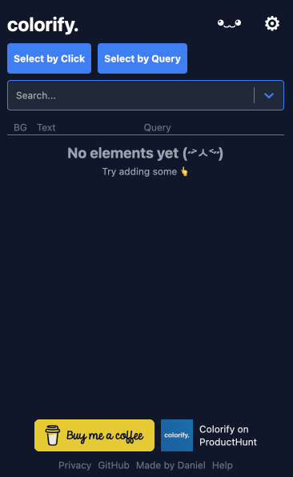
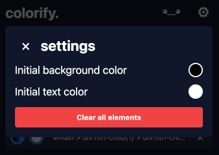
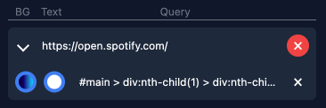

Colorify gives you the power to **customize** the web, your way.

<h2 align="center">colorify</h2>

Colorify is an <strong>open-source</strong> MIT-licensed <strong>browser extension</strong> designed to modify the look of any web element, anywhere. With Colorify, you can change the look of text, backgrounds, buttons, links, or <strong>anything on any website you visit</strong>. Colorify is available for <strong>Chrome</strong>.

 

## Questions

Open up an issue or discussion if you have any questions! I'll try to get back to you as soon as possible.

## How to contribute

### Adding new features or fixing bugs

If you would like to add a new feature to colorify or fix a bug, submit an issue in GitHub (if there is no existing one)!

To build and debug the extension, fork the repo. Install development dependencies by running npm install in the project root folder. Then execute npm run dev.

### Chrome and Edge

1. Open the chrome://extensions page.
2. Disable the official Colorify extension.
3. Enable the Developer mode.
4. Click Load unpacked extension button.
5. Navigate to the project's build/debug/chrome folder.

 

<a href="https://www.producthunt.com/products/colorify-2" target="_blank" rel="noreferrer">
    
Find colorify on ProductHunt

</a>

## Using colorify for a website

You can use colorify to change the look of a website by selecting an element on the screen or entering a CSS selector. Upon opening the extension you'll be greeted by a popup that looks like this:

After clicking "select by click," you can hover over and select the element on your current page, outlined in red. All elements are selectable, including text, images, and buttons, and persist across page reloads. Your settings are even saved across devices if you use Chrome Sync.

Search websites that have selected elements using the search bar. You can set the initial background and text color for selected elements by selecting the cog in the top right corner. 

You'll also find the option to clear all elements, which will remove all selected elements from all pages. Deleting elements is easy! Click the red icon to clear all elements from a website, or remove them individually by clicking the X next to the element.

If you have any issues or want to fix something, please open an issue on GitHub! I'll try to get back to you as soon as possible.

 
 

